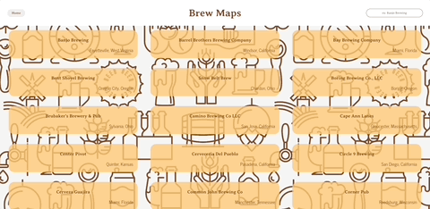
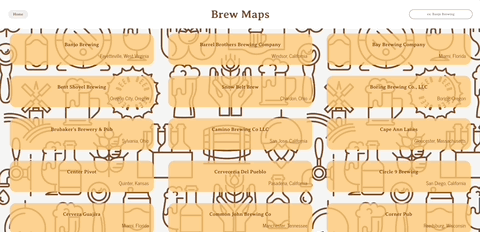

# Brew Maps

- [Contributors](#contributors)
- [Introduction](#introduction)
- [Learning Goals](#learning-goals)
- [Technologies](#technologies)
- [Features](#features)
- [Page Demo](#page-demo)
- [Future Extensions](#possible-future-extensions)
- [Set Up](#set-up)
- [Project Spec](#project-spec)
- [GitHub Repo](#github-repo)
- [Deploy Link](#deploy-link)
- [Additional Resources](#additional-resources)

## Contributors

[Rachel Hill](https://github.com/rachellhill)

[Stephanie Roe](https://github.com/stephanie-roe)

[Nicholas Ao](https://github.com/aominhlong)

[Igor Decess](https://github.com/userigorgithub)

## Introduction
Save yourself time trying to find a good brewery and use Brew Maps, where you can find a perfect brew for you. You can scroll through the list of breweries and look at their reviews and where they are located. Want to see if a brewery's is good? Search for it using our responsive search bar and look at the reviews. 

Brew Maps is a group project for Module 3 that is a cummulation of Module 3's lessons on React, Express, Cypress E2E testing, and Router. 

## Learning Goals
- Learning how to self-teach a new topic: TypeScript 
- Successfully implement TypeScript 
- Build a good understanding of TypeScript

## Technologies
  - React
  - TypeScript
  - HTML
  - CSS
  - Express
  - Cypress
  - Fetch API
  - Webpack
  - NPM
  - Router

## Features
- Upon page load, the user is presented with 20 different breweries.
- A user can search for a specific brewery and the breweries will populate on the page based on the user's input.
- When a user clicks on a brewery, they are taken to a screen with the brewery name and reviews for that brewery.
- Users can leave their own review on a brewery.
- Users can utilize the forward/backward arrows to navigate their history on the site and can share a specific URL pertaining to each brewery.

## Page Demo

## Possible Future Extensions
- Create a user login
- Add images for the breweries
- Allow users to favorite a brewery

## Front End Set Up Instructions
1. Fork and clone this repo.
2. Read this README thoroughly.
3. Type `cd brew-maps` to move into the root directory.
4. Run `npm install` to install necessary dependencies.
5. Run `npm start`.
6. Copy the url given by running `npm start` and open in your browser.
7. Run Cypress tests with `npm run cypress` if all dependencies are installed correctly.
    - Before running Cypress, restart the back end server (instructions below). 
8. Explore the available movies and see their details!

## Back End Set Up Instructions
In addition to the above repo running in your terminal, you will also need to follow the steps below to start the back end api that we created.
1. Clone down [THIS](https://github.com/stephanie-roe/brew-maps-api) repo
2. `cd` into `brew-maps-api`
3. Run `npm init`
4. Run `npm i express`
5. Run `node server.js` to start the back end server

## Project Spec
- The spec for this project can be found [here](https://frontend.turing.edu/projects/module-3/stretch.html).

## Project GitHub Repo
- The project repo can be found [here](https://github.com/stephanie-roe/brew-maps).

## Additional Resources
- [Figma Wireframe](https://www.figma.com/file/K2LrejI9HbLbFltwvCRq0V/Wireframe-%7C-Stretch-Tech?node-id=3%3A35)
